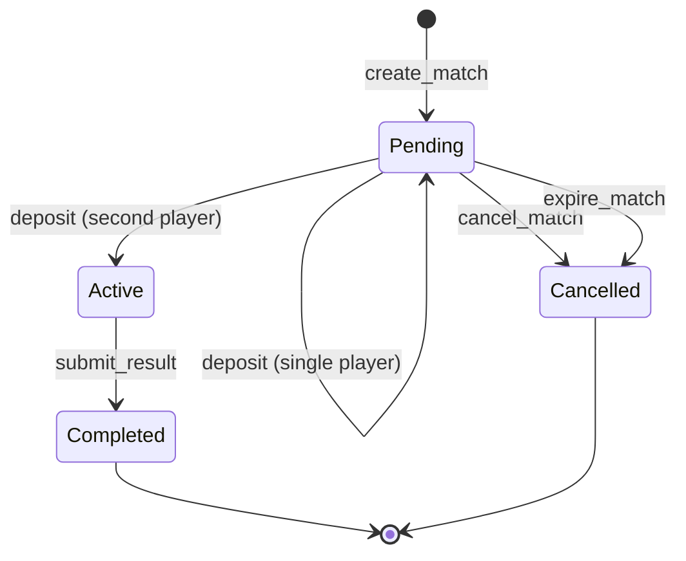

# Architecture Overview

Checkmate-Escrow is a trustless chess wagering platform built on Stellar Soroban smart contracts. This document describes the high-level architecture and the stable public API surface.

## Components

```
┌─────────────┐     create/deposit/cancel     ┌──────────────────┐
│   Players   │ ─────────────────────────────▶│  Escrow Contract │
└─────────────┘                               └────────┬─────────┘
                                                       │ submit_result
┌─────────────┐     verify game result                 │
│   Oracle    │ ─────────────────────────────▶─────────┘
└─────────────┘
      │
      │ polls
      ▼
┌──────────────────────┐
│  Lichess / Chess.com │
└──────────────────────┘
```

- **Escrow Contract** (`contracts/escrow`): Holds player stakes, enforces match lifecycle, and executes payouts.
- **Oracle Contract** (`contracts/oracle`): Bridges external chess platform APIs to the escrow contract, submitting verified match results on-chain.

## Match Lifecycle



### Transition Reference

| From | To | Triggering Function | Authorized Caller | Conditions | Key Errors |
|---|---|---|---|---|---|
| `*` | `Pending` | `create_match` | `player1` | Contract not paused; `stake_amount > 0`; `game_id` non-empty and unique; token on allowlist (if enforced). | `ContractPaused`, `InvalidAmount`, `AlreadyExists`, `InvalidGameId`, `InvalidToken` |
| `Pending` | `Pending` | `deposit` | `player1` or `player2` | Match exists; contract not paused; caller has not already deposited; transfers `stake_amount` to escrow. | `ContractPaused`, `MatchNotFound`, `InvalidState`, `Unauthorized`, `AlreadyFunded` |
| `Pending` | `Active` | `deposit` | `player1` or `player2` | Same as above, **and** this deposit completes funding (both `player1_deposited` and `player2_deposited` are now `true`). | (same as single deposit) |
| `Pending` | `Cancelled` | `cancel_match` | `player1` or `player2` | Match is in `Pending` state; refunds any deposited stakes. | `MatchNotFound`, `MatchAlreadyActive`, `Unauthorized` |
| `Pending` | `Cancelled` | `expire_match` | Anyone | Match is in `Pending` state; ledger timeout (`MatchTimeout`, default ~24h) has elapsed since `created_ledger`; refunds any deposited stakes. | `MatchNotFound`, `InvalidState`, `MatchNotExpired` |
| `Active` | `Completed` | `submit_result` | Oracle address stored at initialization | Match is in `Active` state; contract not paused; both players have deposited; oracle auth required. **Payout is executed inline** (winner receives `2 * stake_amount`, or each player receives `stake_amount` on draw). | `Unauthorized`, `ContractPaused`, `MatchNotFound`, `NotFunded`, `InvalidState` |
| `Completed` | — | — | — | Terminal state. No further transitions. | — |
| `Cancelled` | — | — | — | Terminal state. No further transitions. | — |

> **Note:** `execute_payout` is not a separate external function in the current implementation. The escrow contract pays out atomically inside `submit_result`.

## Stable Public API

The following types and contract functions are considered stable. External integrations and tooling should rely only on these.

### `Match` Struct

Returned by `get_match(match_id)`. All fields below are stable and safe to read.

| Field              | Type            | Description |
|--------------------|-----------------|-------------|
| `id`               | `u64`           | Unique match identifier. |
| `player1`          | `Address`       | Match creator (first player). |
| `player2`          | `Address`       | Invited opponent (second player). |
| `stake_amount`     | `i128`          | Amount each player stakes, in the token's smallest unit. |
| `token`            | `Address`       | Token contract address used for staking (XLM or USDC). |
| `game_id`          | `String`        | External game ID from the chess platform. |
| `platform`         | `Platform`      | Chess platform: `Lichess` or `ChessDotCom`. |
| `state`            | `MatchState`    | Current lifecycle state (see below). |
| `winner`           | `Winner`        | Match outcome once completed; defaults to `Draw` until set. |
| `created_ledger`   | `u32`           | Ledger sequence at match creation. |
| `completed_ledger` | `Option<u32>`   | Ledger sequence at completion or cancellation, if applicable. |

> **Internal fields** — `player1_deposited` and `player2_deposited` are internal bookkeeping. Use `is_funded(match_id)` to check whether a match is fully funded.

### `MatchState` Enum

| Variant     | Meaning |
|-------------|---------|
| `Pending`   | Match created; awaiting both deposits. |
| `Active`    | Both players deposited; game in progress. |
| `Completed` | Result submitted and payout executed. |
| `Cancelled` | Cancelled before activation; stakes refunded. |

### `Winner` Enum

| Variant   | Meaning |
|-----------|---------|
| `Player1` | Player 1 won. |
| `Player2` | Player 2 won. |
| `Draw`    | Game ended in a draw; stakes returned to both players. |

### Contract Functions

#### Match Management

| Function | Signature | Description |
|----------|-----------|-------------|
| `create_match` | `(player1: Address, player2: Address, stake_amount: i128, token: Address, game_id: String, platform: Platform) -> u64` | Creates a new match and returns its ID. |
| `get_match` | `(match_id: u64) -> Match` | Returns the current state of a match. |
| `cancel_match` | `(match_id: u64)` | Cancels a match and refunds any deposits. |

#### Escrow

| Function | Signature | Description |
|----------|-----------|-------------|
| `deposit` | `(match_id: u64)` | Deposits the caller's stake into escrow. |
| `get_escrow_balance` | `(match_id: u64) -> i128` | Returns the total escrowed balance for a match. |
| `is_funded` | `(match_id: u64) -> bool` | Returns `true` when both players have deposited. |

#### Oracle & Payouts

| Function | Signature | Description |
|----------|-----------|-------------|

| `submit_result` | `(match_id: u64, winner: Winner)` | Oracle submits the verified match result. Payout (or draw refund) is executed atomically in the same transaction — there are no separate `verify_result` or `execute_payout` functions. |

#### Read Indexes

| Function | Signature | Description |
|----------|-----------|-------------|
| `get_player_matches` | `(player: Address) -> Vec<u64>` | Returns all match IDs (past and present) for a player. |
| `get_pending_matches` | `() -> Vec<Match>` | Returns pending matches currently in `Pending` state, awaiting deposit completion. |
| `get_active_matches` | `() -> Vec<Match>` | Returns active matches currently in `Active` state, fully funded and ready for result submission. |

## Index Behavior, TTL Caveats, and Pagination

### Player-Match Index (`get_player_matches`)

`get_player_matches` reads a `Vec<u64>` stored under `DataKey::PlayerMatches(player)` in persistent storage. The index is append-only: a match ID is added when `create_match` is called and is **never removed**, regardless of the match outcome. This means:

- The list grows monotonically over a player's lifetime.
- It includes `Completed` and `Cancelled` matches as well as live ones.
- To determine a match's current state, call `get_match(match_id)` for each ID.

### Pending-Match Query (`get_pending_matches`)

`get_pending_matches` scans all created matches and returns those currently in `Pending` state. A pending match has been created but has not yet reached full funding; it may have zero, one, or both deposits recorded, but it remains pending until the second player deposits.

### Active-Match Query (`get_active_matches`)

`get_active_matches` scans all created matches and returns those currently in `Active` state. An active match is fully funded and ready for result submission. It excludes pending, completed, and cancelled matches.

> **Note:** Because these query methods scan per-match storage, off-chain consumers should still verify a match's current state with `get_match(match_id)` before taking critical action.

### TTL Caveats

`get_player_matches` is a persistent append-only index stored under `DataKey::PlayerMatches(player)`. The index is updated on `create_match` and carries a TTL of `MATCH_TTL_LEDGERS` (~30 days at 5 s/ledger). If no matches are created or resolved for a player for ~30 days, that player-specific index may expire and `get_player_matches` can return an empty list.

`get_pending_matches` and `get_active_matches` are filtered getters that scan all `Match` records by state. They do not rely on separate persistent index entries and therefore reflect current match state directly from stored match data.

Individual `Match` records in persistent storage follow the same ~30-day TTL and are extended on every write to that match.

Off-chain indexers should not rely solely on these on-chain values for long-term history. Subscribe to contract events (`match.created`, `match.result`, `match.cancelled`) for a durable record.

### Pagination

`get_pending_matches` and `get_active_matches` return the full filtered result set in a single call. Use `get_pending_matches_paginated(player, offset, limit)` or `get_active_matches_paginated(offset, limit)` to fetch bounded pages of pending or active matches respectively.

`get_player_matches` also returns the full vector of match IDs for a player. For large player histories, apply client-side slicing on the returned `Vec<u64>`.

```rust
// Example: fetch page of 20 starting at offset 40
let all_ids = client.get_player_matches(&player);
let page: Vec<u64> = all_ids.iter().skip(40).take(20).collect();
```

